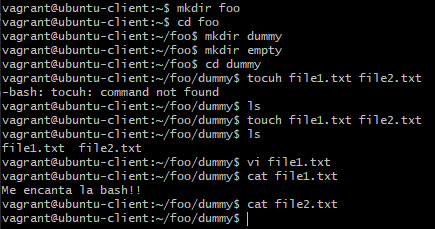

## 1. Crea mediante comandos de bash la siguiente jerarquía de ficheros y directorios

```bash
foo/
├─ dummy/
│  ├─ file1.txt
│  ├─ file2.txt
├─ empty/
```

Donde `file1.txt` debe contener el siguiente texto:

```bash
Me encanta la bash!!
```

Y `file2.txt` debe permanecer vacío.

## Solución

```bash

mkdir foo

cd foo

mkdir dummy empty

cd dummy

touch file1.txt file2.txt

vi file1.txt

-- INSERT --
    Me encanta la bash!!
    ESC + :wq

cat file1.txt
```

### Captura de Pantalla

Aquí está la captura de pantalla que muestra el resultado del comando:


