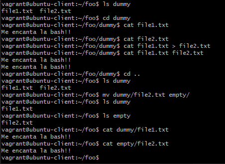

## 2. Mediante comandos de bash, vuelca el contenido de file1.txt a file2.txt y mueve file2.txt a la carpeta empty

El resultado de los comandos ejecutados sobre la jerarquía anterior deben dar el siguiente resultado.

```bash
foo/
├─ dummy/
│  ├─ file1.txt
├─ empty/
  ├─ file2.txt
```

Donde `file1.txt` y `file2.txt` deben contener el siguiente texto:

```bash
Me encanta la bash!!
```

## Solución

```bash

cat file1.txt > file2.txt

cat file.txt file2.txt

cd ..

mv dummy/file2.txt empty/

cat empty/file2.txt dummy/file1.txt
```

### Captura de pantalla

Aquí está la captura de pantalla que muestra el resultado del comando:


