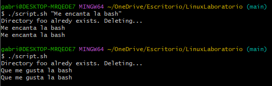

### 3. Crear un script de bash que agrupe los pasos de los ejercicios anteriores y además permita establecer el texto de file1.txt alimentándose como parámetro al invocarlo

Si se le pasa un texto vacío al invocar el script, el texto de los ficheros, el texto por defecto será:

```bash
Que me gusta la bash!!!!
```

## Script

```bash
#!/bin/bash

DIRECTORY="foo"
FILE_CONTENT="${1:-Que me gusta la bash}"
FILE_PATH="$DIRECTORY/dummy/file1.txt"

# Comprobamos si el directorio existe. Si existe, se borra
if [ -d "$DIRECTORY" ]; then
	echo "Directory $DIRECTORY alredy exists. Deleting..."
	rm -rf "$DIRECTORY"
else
	echo "Directory $DIRECTORY doesn't exists. Continuing..."
fi

# Creando los subdirectorios y los files.
mkdir -p "$DIRECTORY/dummy" "$DIRECTORY/empty"

touch "$FILE_PATH"
echo "$FILE_CONTENT" > "$FILE_PATH"

cd "$DIRECTORY/dummy" || exit
touch file2.txt

cat file1.txt > file2.txt

cd ../..||exit

mv "$DIRECTORY/dummy/file2.txt" "$DIRECTORY/empty/"

cat "$DIRECTORY/dummy/file1.txt" "$DIRECTORY/empty/file2.txt"
```

## Captura de pantalla


