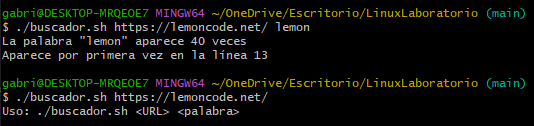

### 5. OPCIONAL - Modifica el ejercicio anterior de forma que la URL de la página web se pase por parámetro y también verifique que la llamada al script sea correcta

Si al invocar el script este no recibe dos parámetros (URL y palabra a buscar), se deberá de mostrar el siguiente mensaje:

```bash
$ ejercicio5.sh https://lemoncode.net/ patata 27
> Se necesitan únicamente dos parámetros para ejecutar este script
```

Además, si la palabra sólo se encuentra una vez en el fichero, se mostrará el siguiente mensaje:

```bash
$ ejercicio5.sh https://lemoncode.net/ patata
> La palabra "patata" aparece 1 vez
> Aparece únicamente en la línea 27
```

## Script

```bash
#!/bin/bash

# Verifica que se pasen dos argumentos
if [ "$#" -ne 2 ]; then
    echo "Uso: $0 <URL> <palabra>"
    exit 1
fi

# Asignación de variables, se pasarán como parámetros
URL=$1
WORD=$2

# Descargar el contenido de la página web
curl -k -s -L "$URL" -o contenido.html || { echo "Error al descargar la página."; exit 1; }

# Contar el número de ocurrencias de la palabra
COUNT=$(grep -o -i "$WORD" contenido.html | wc -l)

# Verificar cuántas veces aparece la palabra
if [ "$COUNT" -eq 0 ]; then
    echo "No se ha encontrado la palabra \"$WORD\""
# Si sólo aparece una vez
elif [ "$COUNT" -eq 1 ]; then
    echo "La palabra \"$WORD\" aparece 1 vez"
    LINE=$(grep -ni "$WORD" contenido.html | head -n 1 | cut -d: -f1)
    echo "Aparece únicamente en la línea $LINE"
else
    LINE=$(grep -ni "$WORD" contenido.html | head -n 1 | cut -d: -f1)
    echo "La palabra \"$WORD\" aparece $COUNT veces"
    echo "Aparece por primera vez en la línea $LINE"
fi

rm contenido.html
```

## Captura de pantalla


